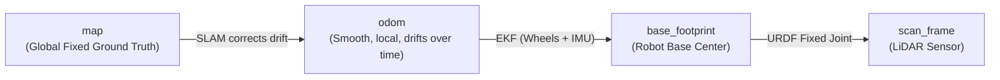

# 🧭 Chapter 1: Mastering 2D SLAM & SLAM Toolbox

Welcome to the comprehensive reference guide for **2D Simultaneous Localization and Mapping (SLAM)** using **SLAM Toolbox** in ROS 2. This document details the architectural concepts, mathematical theory, configuration tuning, and real-world lessons learned on the **Gizmo 2WD Robot**.

---

## 📌 Table of Contents
1. [Core Philosophy & The TF Hierarchy](#1-core-philosophy--the-tf-hierarchy)
2. [Pose-Graph SLAM & Optimization Math](#2-pose-graph-slam--optimization-math)
3. [Deep Dive: `slam_toolbox.yaml` Line-by-Line](#3-deep-dive-slam_toolboxyaml-line-by-line)
4. [The Anatomy of a 2D Map (`.pgm` + `.yaml`)](#4-the-anatomy-of-a-2d-map-pgm--yaml)
5. [False Loop Closures & Ghost Room Elimination](#5-false-loop-closures--ghost-room-elimination)
6. [Lifecycle Management in ROS 2](#6-lifecycle-management-in-ros-2)
7. [Essential Engineering Lessons Learned](#7-essential-engineering-lessons-learned)

---

## 1. Core Philosophy & The TF Hierarchy

In ROS 2, coordinate frames strictly follow the **Parent $\to$ Child (`A ➔ B`)** convention:
$$\text{Where is } \mathbf{B} \text{ located with respect to } \mathbf{A}\text{?}$$

```
[City Origin]   ➔   [Your Neighborhood]   ➔   [Your Body]        ➔   [Your Eyes]
     map        ➔          odom           ➔  base_footprint      ➔   scan_frame
 (SLAM Global)      (Smooth Local EKF)       (Robot Ego Center)     (Physical Sensor)
```



### 👟 The "Sheet of Paper" Analogy
* **`map`:** The stationary physical building (fixed forever at $(0,0,0)$).
* **`base_footprint`:** The robot.
* **`odom`:** A sheet of paper taped under the robot's wheels that tracks wheel revolutions.

When the wheels slip, the virtual paper (`odom`) slides and drifts away from the real room. **SLAM does not rewrite the wheel odometry counters.** Instead, SLAM computes the offset **`map ➔ odom`** (virtually shifting the sheet of paper) so that the final position:

$$\text{Pose}_{\text{base\_footprint in map}} = (\mathbf{map \rightarrow odom}) \times (\mathbf{odom \rightarrow base\_footprint})$$

remains **100% accurate** in the real world!

### 📍 When is the `map` Origin $(0, 0, 0)$ Created?
At the exact timestamp $t = 0$ when `slam_toolbox` is configured and activated, the **exact physical spot where the robot is standing becomes the $(0, 0, 0, \theta = 0)$ origin of the `map` frame.**

#### 🚗 Scenario: What if you drive the robot BEFORE starting SLAM?
Suppose:
1. You launch Gazebo $\rightarrow$ `odom` frame origin is created at $(0, 0, 0)$.
2. You drive Gizmo forward by **$+1.0\text{ meter}$** using teleop:
   $$\mathbf{odom \rightarrow base\_footprint} = (+1.0, 0.0, 0.0)$$
3. **Now, you launch `slam_toolbox`:**
   - SLAM declares: *"Where the robot is standing right now is my `map` $(0, 0, 0)$ origin!"*
   - Therefore, the robot's pose in the map must be $(0.0, 0.0, 0.0)$.
   - To make the TF math align, SLAM automatically sets the **`map ➔ odom`** offset to **$(-1.0, 0.0, 0.0)$**:

$$\text{Pose}_{\text{base\_footprint in map}} = (\mathbf{map \rightarrow odom}) + (\mathbf{odom \rightarrow base\_footprint})$$
$$\text{Pose}_{\text{base\_footprint in map}} = (-1.0) + (+1.0) = \mathbf{(0.0, 0.0, 0.0)}$$

```
[map origin (0,0)] = (Where you launched SLAM)
      |
      | -1.0m (map -> odom)
      v
[odom origin] = (Where Gazebo simulation booted)
      |
      | +1.0m (odom -> base_footprint)
      v
[Robot base_footprint] = (0.0, 0.0) in map coordinates!
```

> **💡 Real-World Takeaway:** This is why commercial robots (like warehouse AMRs and vacuum cleaners) always start their initial mapping run while seated on their physical charging dock—ensuring the map origin $(0,0,0)$ aligns with the dock!

---

## 2. Pose-Graph SLAM & Optimization Math

SLAM Toolbox is an **Exact 2D Pose-Graph SLAM** system. It models the mapping problem as a graph:
* **Nodes ($X_i = [x_i, y_i, \theta_i]^T$):** Robot poses at distinct keyframes.
* **Edges ($E_{ij}$):** Spatial constraints between poses (from wheel odometry and laser scan matching).

Whenever a loop closure or new scan match occurs, Google **Ceres Solver** solves the non-linear least-squares optimization problem:

$$\min_{X} \sum_{ij} \mathbf{e}_{ij}(X_i, X_j)^T \boldsymbol{\Omega}_{ij} \mathbf{e}_{ij}(X_i, X_j)$$

where $\mathbf{e}_{ij}$ is the error vector between the predicted transformation and the laser scan observation, weighted by the information (confidence) matrix $\boldsymbol{\Omega}_{ij}$.

---

## 3. Deep Dive: `slam_toolbox.yaml` Line-by-Line

Below is the annotated breakdown of our tuned configuration:

```yaml
slam_toolbox:
  ros__parameters:

    # ==========================================
    # 1. CERES NON-LINEAR SOLVER CONFIGURATION
    # ==========================================
    solver_plugin: solver_plugins::CeresSolver
    ceres_linear_solver: SPARSE_NORMAL_CHOLESKY # Cholesky decomposition for sparse Hessian matrices
    ceres_preconditioner: SCHUR_JACOBI         # Accelerates convergence of matrix diagonals
    ceres_trust_strategy: LEVENBERG_MARQUARDT  # Hybrid Gradient Descent + Gauss-Newton algorithm
    ceres_dogleg_type: TRADITIONAL_DOGLEG
    ceres_loss_function: None                  # Standard squared loss L(r) = 0.5 * r^2

    # ==========================================
    # 2. COORDINATE FRAMES & OPERATING MODE
    # ==========================================
    odom_frame: odom                           # Source of continuous local odometry (from EKF)
    map_frame: map                             # Global coordinate frame anchor
    base_frame: base_footprint                 # Base frame of the robot on the ground plane
    scan_topic: /scan                          # 2D LaserScan input topic
    use_map_saver: true                        # Enables map-saving service endpoints
    mode: mapping                              # 'mapping' (build new graph) vs 'localization' (static)

    # ==========================================
    # 3. TIMING & RASTERIZATION GEOMETRY
    # ==========================================
    debug_logging: false
    throttle_scans: 1                          # Process all incoming scans (1 = no drop)
    transform_publish_period: 0.02             # Publish map->odom TF at 50 Hz (1 / 0.02s)
    map_update_interval: 1.0                   # Recalculate and publish full /map image every 1.0s (Fast & responsive)
    resolution: 0.05                           # 5 cm per grid cell (0.05m x 0.05m per pixel)
    restamp_tf: true                           # Re-stamps map->odom with current ROS clock to prevent TF cache drop
    min_laser_range: 0.08                      # Matches Gizmo LiDAR minimum physical range (0.08m)
    max_laser_range: 10.0                      # Matches Gizmo LiDAR maximum physical range (10.0m)
    minimum_time_interval: 0.2                 # Ingest scans at up to 5 Hz (0.2s minimum period)
    transform_timeout: 0.2                     # Maximum time to wait for TF lookup
    tf_buffer_duration: 30.0                   # Keep 30 seconds of historical transforms in memory
    stack_size_to_use: 40000000                # 40 MB stack memory allocated for serializing large graphs
    enable_interactive_mode: true

    # ==========================================
    # 4. MOTION THRESHOLDS & GRAPH SPARSITY
    # ==========================================
    use_scan_matching: true                    # Use laser correlative alignment over raw odometry
    use_scan_barycenter: true                  # Use center-of-mass of scan points to stabilize rotation
    minimum_travel_distance: 0.2               # Add new graph node only after robot moves 20 cm
    minimum_travel_heading: 0.2                # Add new graph node only after robot turns ~11.5° (0.2 rad)
    check_min_dist_and_heading_precisely: false

    # ==========================================
    # 5. SCAN MATCHING & CORRELATION WINDOWS
    # ==========================================
    scan_buffer_size: 10                       # Number of scans kept in the local sliding window
    scan_buffer_maximum_scan_distance: 10.0    # Maximum distance for buffer tracking
    link_match_minimum_response_fine: 0.45     # Requires 45% scan match confidence between consecutive nodes
    link_scan_maximum_distance: 1.5            # Max distance between linked scans

    # Multi-Resolution Search Windows:
    correlation_search_space_dimension: 0.5    # Search within a 50cm box around odometry prediction
    correlation_search_space_resolution: 0.01   # 1 cm step resolution during correlative search
    correlation_search_space_smear_deviation: 0.1
    fine_search_angle_offset: 0.00349          # Fine angular refinement step (~0.2°)
    coarse_search_angle_offset: 0.349          # Coarse angular search window (±20°)
    coarse_angle_resolution: 0.0349            # Coarse angular step resolution (~2°)

    # ==========================================
    # 6. LOOP CLOSURE (GHOST ROOM PREVENTION)
    # ==========================================
    do_loop_closing: true                      # Enable global loop closure optimization
    loop_match_minimum_chain_size: 10          # Require 10 consecutive matching scans before closing loop
    loop_match_maximum_variance_coarse: 0.5     # Reject any loop closure candidate with variance > 0.5
    loop_match_minimum_response_coarse: 0.65   # Require 65% coarse confidence to consider loop candidate
    loop_match_minimum_response_fine: 0.70     # Require 70% fine confidence to accept loop closure
    loop_search_maximum_distance: 3.0          # Search radius for candidate poses
    loop_search_space_dimension: 6.0           # 6.0m search window for loop candidates
    loop_search_space_resolution: 0.05
    loop_search_space_smear_deviation: 0.03

    # ==========================================
    # 7. OCCUPANCY PROBABILITY & PENALTIES
    # ==========================================
    distance_variance_penalty: 0.5             # Penalty for translational deviation from odometry
    angle_variance_penalty: 1.0                # Penalty for rotational deviation from odometry
    minimum_angle_penalty: 0.9
    minimum_distance_penalty: 0.5
    use_response_expansion: true
    min_pass_through: 2                        # Beam must pass 2 times to mark cell as Free (White)
    occupancy_threshold: 0.1                   # Hit probability > 10% marks cell as Occupied (Black)
```

---

## 4. The Anatomy of a 2D Map (`.pgm` + `.yaml`)

When you save a map using:
```bash
ros2 run nav2_map_server map_saver_cli -f /path/to/my_map
```
It outputs two complementary files:
1. **`my_map.pgm`:** A raw 2D grayscale image (Portable Gray Map).
2. **`my_map.yaml`:** Metadata that gives the image physical dimensions and geographic location.

### Example `.yaml` Metadata:
```yaml
image: simple_world_map.pgm
resolution: 0.05             # 1 pixel = 0.05 meters (5 cm)
origin: [-4.5, -3.2, 0.0]    # [X, Y, Yaw] world coordinates of Pixel (0,0) in meters
negate: 0
occupied_thresh: 0.65        # Pixels with value > 0.65 are solid obstacles
free_thresh: 0.25            # Pixels with value < 0.25 are traversable free space
```

```
+---------------------------------------------+
|                                             |
|                                             |
|              * (0,0) World Origin           |
|                Pixel (90, 64)               |
|                                             |
+---------------------------------------------+
Pixel (0, 0)
World Coordinates (-4.5m, -3.2m)
```

### 📐 The Pixel-to-World Translation Formula:
For any pixel at coordinate $(u, v)$ (where $u$ is column index from the left, $v$ is row index from the bottom):

$$\mathbf{X_{\text{world}}} = \text{origin}[0] + (u \times \text{resolution})$$
$$\mathbf{Y_{\text{world}}} = \text{origin}[1] + (v \times \text{resolution})$$

### 🎯 Finding the Robot's Starting Pose Pixel $(0,0)$ in the Image:
$$\text{Pixel } X = \frac{0.0 - (-4.5)}{0.05} = \frac{4.5}{0.05} = \mathbf{90\text{ pixels from the left}}$$
$$\text{Pixel } Y = \frac{0.0 - (-3.2)}{0.05} = \frac{3.2}{0.05} = \mathbf{64\text{ pixels from the bottom}}$$

### 💡 Fun Fact: What happens if you edit the image?
* **Adding pixels to TOP or RIGHT:** Pixel $(0,0)$ does not move $\rightarrow$ `origin` in `.yaml` **stays identical**.
* **Adding 1 pixel to the LEFT:** Pixel $(0,0)$ moves left $\rightarrow$ Change `origin[0]` to `-4.55` (subtract $0.05\text{m}$).
* **Adding 1 pixel to the BOTTOM:** Pixel $(0,0)$ moves down $\rightarrow$ Change `origin[1]` to `-3.25` (subtract $0.05\text{m}$).

---

## 5. False Loop Closures & Ghost Room Elimination

### 👻 Why "Ghost Rooms" Happen:
In symmetric environments (e.g. square rooms or corridors with $90^\circ$ corners), opposite walls look identical to a 2D LiDAR ray. 

If loop closure thresholds are too loose (e.g., `loop_match_minimum_response_coarse: 0.35`), SLAM accepts a weak 35% match between wall A and perpendicular wall B. The Ceres solver forces the graph to align, rotating the map by $\approx 15^\circ$ and creating a duplicate **"ghost room"**.

### 🛡️ The Solution:
* Increase coarse loop response threshold to **`0.65`** (65% confidence).
* Increase fine loop response threshold to **`0.70`** (70% confidence).
* Lower maximum variance threshold to **`0.5`** to discard ambiguous candidates.

---

## 6. Lifecycle Management & Launch Architecture

In ROS 2, `slam_toolbox` is a **Managed Lifecycle Node** (REP-2002 Standard):
```
[Unconfigured]  ──(Configure)──>  [Inactive]  ──(Activate)──>  [Active (Publishing /map & TF)]
```

---

### 🏗️ The 3 Nodes in `slam.launch.py`:

```
┌────────────────────────────────┐       ┌────────────────────────────────┐       ┌────────────────────────────────┐
│  1. async_slam_toolbox_node    │       │     2. lifecycle_manager       │       │          3. rviz2              │
│       (The Brain & Eyes)       │       │       (The Supervisor)         │       │     (The Visual Window)        │
│                                │       │                                │       │                                │
│ • Ingests LiDAR (/scan)        │       │ • Calls 'Configure' &          │       │ • Visualizes /map, TF trees,   │
│ • Runs Ceres Pose-Graph SLAM   │◄──────┤   'Activate' lifecycle states  │       │   laser scans, & robot model   │
│ • Broadcasts TF (map ➔ odom)   │       │ • Monitors node heartbeat      │       │ • Allows manual 2D pose/goals  │
│ • Streams live /map grid       │       │   (bond connection)            │       │                                │
└────────────────────────────────┘       └────────────────────────────────┘       └────────────────────────────────┘
```

1. **`async_slam_toolbox_node` (`slam_toolbox`):** The mathematical engine. Processes LiDAR scans asynchronously so complex Ceres graph optimizations do not block sensor ingress.
2. **`lifecycle_manager` (`nav2_lifecycle_manager`):** The automated supervisor. Automatically brings `slam_toolbox` from `Unconfigured` $\to$ `Configure` $\to$ `Activate` without manual terminal commands.
3. **`rviz2`:** The graphical interface loading `slam.rviz` for real-time visualization.

---

### ⚡ Execution Order: Python List vs. Lifecycle State Machine

A common question in ROS 2 launch files is:  
> *"Does the order of nodes in `LaunchDescription([...])` control the order in which they execute?"*

#### The Reality:
* **The Python List is Concurrent:** ROS 2 launch engines spawn all nodes in the `LaunchDescription` list in **parallel** across CPU threads simultaneously.
* **The True Startup Order is Controlled by `lifecycle_manager`:**
```python
start_lifecycle_manager = Node(
    package='nav2_lifecycle_manager',
    executable='lifecycle_manager',
    name='lifecycle_manager_slam',
    output='screen',
    parameters=[{
        'use_sim_time': use_sim_time,
        'autostart': True,
        'node_names': ['slam_toolbox'],
        'bond_timeout': 0.0  # Disables bond heartbeat requirement for slam_toolbox
    }]
)
```

> **Why `bond_timeout: 0.0`?**  
> `nav2_lifecycle_manager` defaults to monitoring a `bond` heartbeat client. Because `slam_toolbox` uses standard lifecycle services rather than the bond client, setting `bond_timeout: 0.0` prevents 4.0s startup timeouts!

---

### 🔍 Demystifying `nav2_lifecycle_manager`:
Under the hood, `nav2_lifecycle_manager` is simply a standard C++ ROS 2 node that reads the `node_names` string array and calls standard ROS 2 lifecycle service clients:

```cpp
// What nav2_lifecycle_manager executes under the hood:
auto client = this->create_client<lifecycle_msgs::srv::ChangeState>("/slam_toolbox/change_state");

// 1. Send CONFIGURE transition
req->transition.id = lifecycle_msgs::msg::Transition::TRANSITION_CONFIGURE;
client->async_send_request(req);

// 2. Send ACTIVATE transition
req->transition.id = lifecycle_msgs::msg::Transition::TRANSITION_ACTIVATE;
client->async_send_request(req);
```

Because it uses standard ROS 2 interfaces, **`nav2_lifecycle_manager` can be used to manage ANY lifecycle node in ROS 2** (cameras, motor controllers, AI pipelines), not just Nav2!

---

## 7. Essential Engineering Lessons Learned

| Issue Encountered | Root Cause | Engineering Solution |
| :--- | :--- | :--- |
| **Odometry Runaway Drift** | Fusing linear acceleration in 2D EKF causes quadratic integration error ($x = \frac{1}{2}at^2$). | Disable linear acceleration in `ekf.yaml`; fuse only linear $X$ velocity and gyro angular $Z$ velocity. |
| **Transform Cache Lag Drops** | Gazebo `/tf` bridge clashed with ROS 2 `robot_state_publisher` and `ekf_node`. | Remove `/tf` from `ros_gz_bridge_config.yaml`; set `restamp_tf: true` in `slam_toolbox.yaml`. |
| **Physics Wheel Jitter** | Extreme friction coefficients (`1e15`) caused DART/Bullet matrix singularity. | Set realistic contact friction (`mu1: 1.0`, `mu2: 1.0`) with `minDepth: 0.001` and `maxVel: 0.1`. |
| **High CPU Consumption** | Camera sensors rendering 30 FPS RGB/Depth in Gazebo during 2D mapping. | Added conditional `use_camera:=false` in `sensors.gazebo.xacro` and `gazebo_simpleWorld.launch.py`. |

