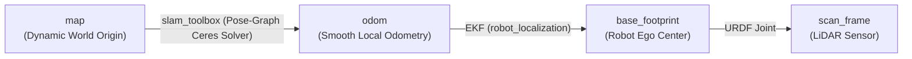
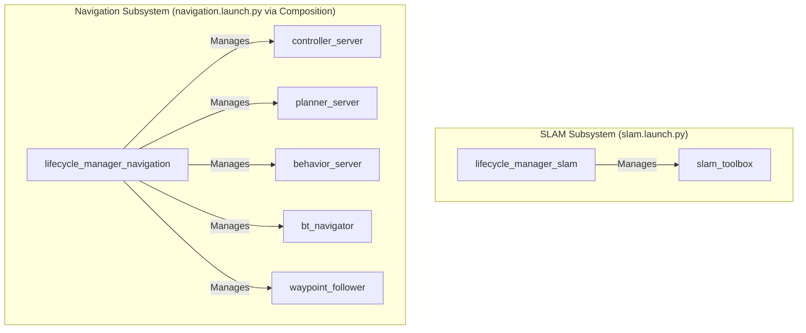
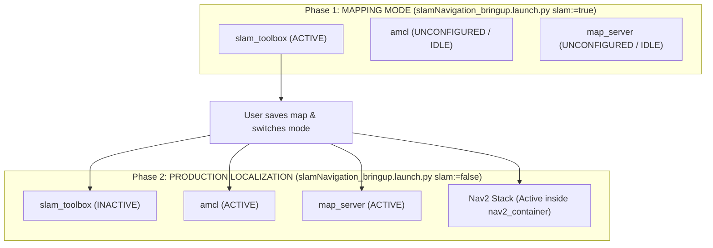

# 🗺️ Chapter 3: Mastering Online SLAM Navigation (Mapping + Nav2)

Welcome to the comprehensive reference guide for **Simultaneous Online SLAM & Autonomous Navigation** in ROS 2. This document explains how to navigate an unknown building **without pre-loading a static map**, allowing the user to click `Nav2 Goal` into unmapped frontiers while **SLAM Toolbox** constructs and refines the occupancy grid in real time.

---

## 📌 Table of Contents
1. [Architectural Philosophy: Static Nav2 vs. Online SLAM Nav2](#1-architectural-philosophy-static-nav2-vs-online-slam-nav2)
2. [Coordinate Frames & The Dynamic Transform Chain](#2-coordinate-frames--the-dynamic-transform-chain)
3. [Why AMCL is Excluded: The Single-Parent TF Rule & Collision War](#3-why-amcl-is-excluded-the-single-parent-tf-rule--collision-war)
4. [Lifecycle Orchestration: Merging SLAM Toolbox & Nav2](#4-lifecycle-orchestration-merging-slam-toolbox--nav2)
5. [The RViz Navigation 2 Panel & UI Binding](#5-the-rviz-navigation-2-panel--ui-binding)
6. [Navigating into the Unknown: Costmap & Planner Mechanics](#6-navigating-into-the-unknown-costmap--planner-mechanics)
7. [Why Nav2 Autonomous Mapping Outperforms Joystick Teleop](#7-why-nav2-autonomous-mapping-outperforms-joystick-teleop)
8. [Pose-Graph Loop Closures During Active Navigation](#8-pose-graph-loop-closures-during-active-navigation)
9. [Step-by-Step Launch & Operational Workflow](#9-step-by-step-launch--operational-workflow)
10. [Saving the Dynamically Generated Map On-The-Fly](#10-saving-the-dynamically-generated-map-on-the-fly)
11. [The 2-Phase Lifecycle & Seamless Mode Switching Architecture](#11-the-2-phase-lifecycle--seamless-mode-switching-architecture)
12. [Comparison Matrix: Static Nav2 vs Online SLAM vs Auto-Exploration](#12-comparison-matrix-static-nav2-vs-online-slam-vs-auto-exploration)

---

## 1. Architectural Philosophy: Static Nav2 vs. Online SLAM Nav2

In conventional static navigation (Chapter 2), a robot requires a pre-recorded map file (`.yaml` + `.pgm`) loaded into `map_server`, and `amcl` estimates the robot's pose on that static map.

In **Online SLAM Navigation**, `map_server` and `amcl` are **completely removed**. Instead, **`slam_toolbox`** acts as both the **Live Map Generator** and the **Global Localization Provider**!

```
                                  [RViz2 / User Interaction]
                                               │
                                       (Click Nav2 Goal)
                                               ▼
                              ┌──────────────────────────────────┐
                              │           bt_navigator           │
                              └───────┬──────────────────┬───────┘
                                      │                  │
                                      ▼                  ▼
                         ┌──────────────────────┐  ┌──────────────────────┐
                         │    planner_server    │  │   behavior_server    │
                         │ (allow_unknown=true) │  └──────────┬───────────┘
                         └──────────┬───────────┘             │
                                    │ (Path into Frontier)    │
                                    ▼                         │
                         ┌──────────────────────┐             │
                         │  controller_server   │             │
                         │    (DWB Controller)  │             │
                         └──────────┬───────────┘             │
                                    │ (/cmd_vel)              │
                                    ▼                         │
                        [Gizmo Drives Forward]                │
                                    │                         │
                                    ▼ (New Laser Scans)       │
                         ┌──────────────────────┐             │
                         │     slam_toolbox     │◄────────────┘
                         │ (Online Async SLAM)  │
                         └──────────┬───────────┘
                                    │
               ┌────────────────────┴────────────────────┐
               ▼ (Publishes /map)                        ▼ (Publishes map ➔ odom TF)
      [global_costmap]                           [Global State Estimation]
```

---

## 2. Coordinate Frames & The Dynamic Transform Chain

In both systems, the coordinate hierarchy remains strictly:
$$\mathbf{map} \longrightarrow \mathbf{odom} \longrightarrow \mathbf{base\_footprint} \longrightarrow \mathbf{scan\_frame}$$



### Key Differences in Transform Authority:

| Responsibility | Static Navigation (`localization.launch.py` + `navigation.launch.py`) | Online SLAM Navigation (`slamNavigation_bringup.launch.py slam:=true`) |
| :--- | :--- | :--- |
| **`map` Frame Authority** | `nav2_amcl` (Particle filter matching static map) | `slam_toolbox` (Scan-to-map Ceres optimization) |
| **`/map` Topic Publisher** | `nav2_map_server` (Static `.pgm` file) | `slam_toolbox` (Dynamic ROS OccupancyGrid stream) |
| **Map Expansion** | Fixed boundaries (e.g. $237 \times 242$) | Dynamically expands canvas as robot explores new rooms |
| **Pre-requisite Files** | `map.yaml` and `map.pgm` required | **None! Zero prior knowledge needed.** |

---

## 3. Why AMCL is Excluded: The Single-Parent TF Rule & Collision War

A common beginner question is: *"Why shouldn't we add the AMCL node during SLAM to get extra localization?"*

```
                  ┌──────────────┐
                  │     map      │
                  └──────┬───────┘
                         │ (Who owns this link?)
             ┌───────────┴───────────┐
             ▼                       ▼
      [slam_toolbox]               [amcl]
   Publishes map ➔ odom     Publishes map ➔ odom
             │                       │
             └───────────┬───────────┘
                         ▼
                  ┌──────────────┐
                  │     odom     │
                  └──────────────┘
```

1. **The Single Parent TF Rule:** In TF2, every coordinate frame must have **EXACTLY ONE parent**.
2. **The Transform Collision War:** Both `slam_toolbox` and `amcl` broadcast the `map ➔ odom` transform. If run simultaneously, they publish competing coordinates 20 times per second, causing the robot model, map, and laser scans to **violently flicker and jump back and forth in RViz!**
3. **The "L" in SLAM is Localization:** `slam_toolbox` is already localizing the robot continuously against its internal pose-graph with Ceres optimization. AMCL is completely redundant during mapping!

---

## 4. Lifecycle Orchestration: Merging SLAM Toolbox & Nav2

In `slamNavigation_bringup.launch.py`, lifecycle management is cleanly decoupled across two specialized lifecycle managers:



### Startup Sequence:
1. **`slam_toolbox` Configures & Activates via `lifecycle_manager_slam`:**  
   Immediately takes the robot's starting spot as $(0, 0, 0)$ in the `map` frame and begins broadcasting `map ➔ odom`.
2. **Costmaps & Nav2 Components Initialize via `lifecycle_manager_navigation`:**  
   Running inside `nav2_container` (process composition), `controller_server`, `planner_server`, `behavior_server`, `bt_navigator`, and `waypoint_follower` activate sequentially. Because `map ➔ odom` is already live from SLAM, costmaps activate with zero TF timeout errors.
3. **Action Servers Stand Up:**  
   `bt_navigator` and `waypoint_follower` connect to `planner_server` and `controller_server`, unlocking the `Nav2 Goal` tool in RViz.

---

## 5. The RViz Navigation 2 Panel & UI Binding

In RViz, the bottom-left **Navigation 2 Panel** queries a specific lifecycle service to verify system health:
$$\mathbf{/lifecycle\_manager\_navigation/is\_active}$$

```
If Lifecycle Manager Name == 'lifecycle_manager_navigation' ──► Status: Active (Buttons Enabled: Pause, Cancel, Waypoints)
If Lifecycle Manager Name == Custom Name                    ──► Status: Unknown (Buttons Greyed Out / Disabled)
```

* To ensure all interactive buttons (`Cancel`, `Pause`, `Waypoint Following`) light up in RViz, the lifecycle manager node in `navigation.launch.py` is named **`lifecycle_manager_navigation`**.

---

## 6. Navigating into the Unknown: Costmap & Planner Mechanics

When navigating in an unmapped building, the robot must plan through **Unknown Space** (grey cells in RViz):

```
Occupancy Values:
[-1: Unknown Space] ──► [0: Free Space] ──► [100: Lethal Wall]
```

### Essential Parameter Configurations:

#### 1. `planner_server` Parameter:
```yaml
planner_server:
  ros__parameters:
    GridBased:
      plugin: "nav2_navfn_planner::NavfnPlanner"
      allow_unknown: true   # CRITICAL: Allows Dijkstra to chart paths through unmapped areas!
```
* **If `allow_unknown: false`:** If you click `Nav2 Goal` in an unmapped grey room, the planner will immediately abort with *"Failed to compute path: Goal is in unknown space"*.
* **If `allow_unknown: true`:** Dijkstra assumes unmapped space is temporarily traversable free space until the LiDAR arrives and updates the costmap!

#### 2. `global_costmap` Parameter:
```yaml
global_costmap:
  global_costmap:
    ros__parameters:
      track_unknown_space: true # Differentiates free space (0) from undiscovered space (-1 / 255)
```

---

## 7. Why Nav2 Autonomous Mapping Outperforms Joystick Teleop

```
[Human Joystick] ──► Sudden Jerks & Rapid Speed Jumps ──► Wheel Slip ──► Large Odom Drift ──► SLAM Strains to Correct
                                                                                                 (Large map ➔ odom gap)

[Nav2 Autonomy]  ──► Smooth DWB Acceleration Profiles ──► Zero Slip  ──► Perfect Odometry ──► SLAM Matches Effortlessly
                                                                                                 (map & odom stay aligned!)
```

1. **Zero Wheel Slip:** DWB enforces smooth acceleration limits ($a_{\text{max}} = 2.5\text{ m/s}^2$), preventing the drive wheels from spinning out.
2. **High Scan Overlap ($>90\%$):** Moving at a steady autonomous pace guarantees dense LiDAR beam overlap, allowing the Ceres scan-matcher to converge in 1–2 iterations with sub-millimeter residuals.
3. **Smooth Continuous Arcs:** Autonomous navigation avoids sharp, violent in-place spins that cause rotational odometry blur.

---

## 8. Pose-Graph Loop Closures During Active Navigation

As Gizmo explores a long corridor and loops back into the starting room, **SLAM Toolbox performs a Loop Closure**:

```
Before Loop Closure: Odometry drift accumulated (virtual wall offset)
After Loop Closure:  Ceres Solver snaps graph nodes into place!
```

### How Nav2 Reacts to Loop Closures:
1. **Instant TF Update:** SLAM Toolbox adjusts `map ➔ odom` by $\Delta x, \Delta y, \Delta \theta$.
2. **Behavior Tree Replanning:** The Behavior Tree (`bt_navigator`) is running a $1.0\text{ Hz}$ replanning loop. When the map shifts, `ComputePathToPose` automatically recalibrates the path to the updated goal position!
3. **Zero Interruption:** Gizmo smoothly curves its trajectory toward the corrected real-world target without stopping or glitching.

---

## 9. Step-by-Step Launch & Operational Workflow
 
### Option A: One-Command End-to-End Bringup (Recommended)
This master launch file starts Gazebo with `simpleBiggerWorld.sdf`, delays 5.0s for physics/TF stabilization, and automatically boots SLAM + Nav2 + RViz:
```bash
ros2 launch gizmo_bringup slamNavigation_simpleBiggerWorld.launch.py
```
*(Pass `headless:=true` if running on a server or low-power machine without GUI).*

### Option B: Modular Two-Terminal Bringup

#### Terminal 1: Launch Gazebo Simulation World
```bash
ros2 launch gizmo_gazebo gazebo_simpleBiggerWorld.launch.py
```

#### Terminal 2: Launch Unified Bringup in SLAM Mode
```bash
ros2 launch gizmo_bringup slamNavigation_bringup.launch.py slam:=true
```

### Operating in RViz:
1. When RViz opens, you will see Gizmo standing in an initially small circular clearing of discovered map.
2. Click **`Nav2 Goal`** on the top toolbar.
3. Click and drag an arrow into the **dark/grey unmapped area** down a distant hallway.
4. Watch Gizmo autonomously plan a path through the unknown frontier, driving forward while the LiDAR continuously expands the white room walls on the fly! 🏁

---

## 10. Saving the Dynamically Generated Map On-The-Fly

Once you have driven Gizmo around the entire building using `Nav2 Goal` and are happy with the completed map, you can save it to disk directly from another terminal:

```bash
ros2 run nav2_map_server map_saver_cli -f /root/ros2_ws/src/gizmo/gizmo_navigation/maps/my_new_world_map
```

This will instantly write:
* `my_new_world_map.yaml` (Metadata & Origin)
* `my_new_world_map.pgm` (High-resolution $0.05\text{m/cell}$ occupancy image)

---

## 11. The 2-Phase Lifecycle & Seamless Mode Switching Architecture

In commercial AMRs (e.g. Roborock, Roomba, Amazon Proteus), robots utilize a **2-Phase Lifecycle** via ROS 2 Managed State Transitions:



### Why Commercial AMRs Switch to Phase 2:
* **Zero Optimization Overhead:** Deactivating `slam_toolbox` frees up CPU resources once the building layout is known.
* **Immutable Ground Truth:** AMCL prevents temporary dynamic obstacles (boxes, pedestrians) from corrupting the static map layout.
* **Zero System Reboot:** Transitioning modes allows the robot to switch from discovery to warehouse patrol smoothly!

---

## 12. Comparison Matrix: Static Nav2 vs Online SLAM vs Auto-Exploration

| Feature | Static Nav2 (`slam:=false`) | Online SLAM Nav2 (`slam:=true`) | Autonomous Frontier Exploration |
| :--- | :--- | :--- | :--- |
| **Map State** | Fixed, pre-loaded from disk | Dynamically created in real-time | Dynamically created in real-time |
| **Localization** | AMCL (Particle Filter) | SLAM Toolbox (Pose-Graph Ceres) | SLAM Toolbox (Pose-Graph Ceres) |
| **Goal Generation** | User clicks known room goal | User clicks unmapped frontier goal | **Algorithm autonomously finds frontiers** |
| **CPU Usage** | Lowest (Ideal for low-power edge compute) | Moderate (SLAM optimization + Nav2) | High (SLAM + Nav2 + Frontier clustering) |
| **Best Used For** | Production delivery, warehouse AMR routes | Initial site mapping, dynamic environments | Completely autonomous robotic surveying |
